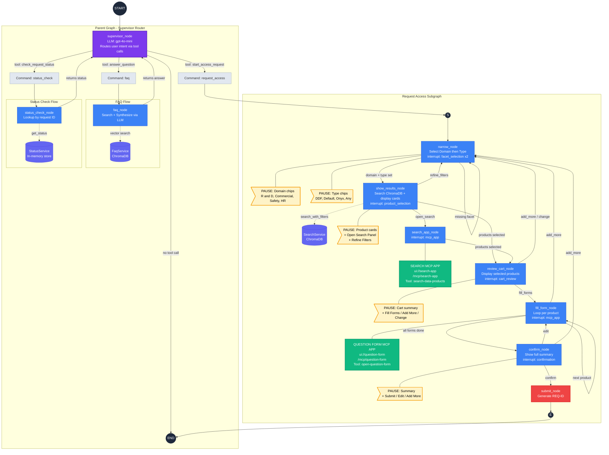
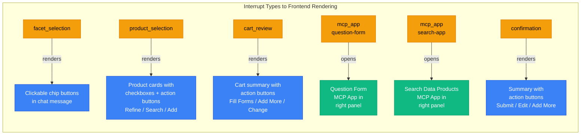
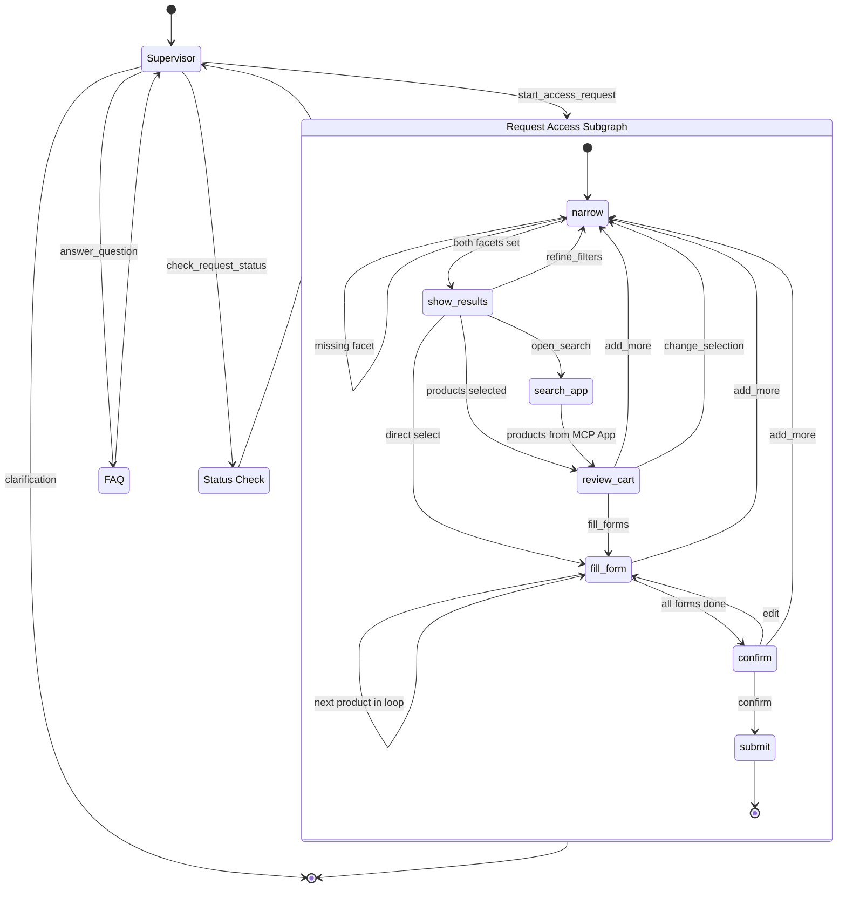
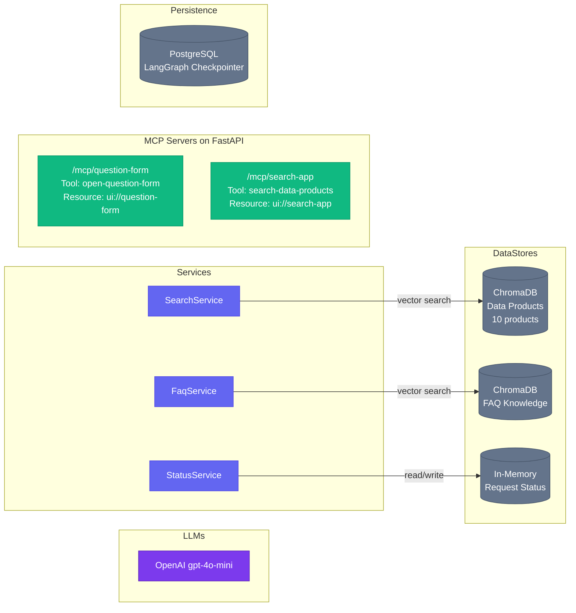

# Data Governance Chat — Graph Architecture

## Full System Diagram

## Interrupt Types at Each Node

Every `interrupt()` call pauses the graph and sends a payload to the frontend.
The frontend renders appropriate UI and resumes the graph with user input.

## Intent Switching — How Users Can Change Direction

The system supports mid-flow navigation at every step. Users can escape to earlier stages or switch intent entirely.

## Services and External Dependencies

## Color Legend

| Color | Meaning |
|---|---|
| **Purple** | Supervisor / LLM nodes |
| **Blue** | Graph nodes (interrupt-driven) |
| **Yellow/Amber** | Interrupt pause points (user input required) |
| **Green** | MCP Apps (interactive UI panels) |
| **Indigo** | Backend services |
| **Gray** | Data stores and persistence |
| **Red** | Terminal node (submit) |

## Node Reference

| Node | Interrupt Type | MCP App | Service | User Actions |
|---|---|---|---|---|
| `supervisor_node` | — | — | OpenAI LLM | Free text, tool routing |
| `narrow_node` | `facet_selection` x2 | — | — | Click domain chip, click type chip |
| `show_results_node` | `product_selection` | — | SearchService (ChromaDB) | Select products, Open Search Panel, Refine Filters |
| `search_app_node` | `mcp_app` | Search MCP App | — | Full search UI in panel, multi-select, confirm |
| `review_cart_node` | `cart_review` | — | — | Fill Forms, Add More, Change Selection |
| `fill_form_node` | `mcp_app` (loops) | Question Form MCP App | — | Fill form, submit, + Add More Products |
| `confirm_node` | `confirmation` | — | — | Submit, Edit Forms, + Add More Products |
| `submit_node` | — | — | — | Terminal: generates REQ-ID |
| `faq_node` | — | — | FaqService (ChromaDB) + LLM | Auto: returns answer |
| `status_check_node` | — | — | StatusService (in-memory) | Auto: returns status |

## Key Design Patterns

### 1. Conversational Funnel + MCP App Escalation
The flow starts with lightweight chat interactions (chip buttons for domain/type selection), progresses to richer in-chat UI (product cards), and escalates to full MCP App panels (search app, form app) only when the interaction requires it.

### 2. Universal "Back to Narrow" Escape Hatch
Every node downstream of `narrow` can route back to it by setting `current_step = "narrow"` and clearing `selected_domain`, `selected_type`, and `search_results`. This enables:
- **Refine Filters** from `show_results`
- **Add More Products** from `review_cart`, `fill_form`, and `confirm`
- **Change Selection** from `review_cart`

### 3. Supervisor as Intent Classifier
The supervisor uses LLM tool-calling to classify user intent into one of three flows. If intent is unclear, it asks for clarification instead of guessing. After FAQ or Status Check, control returns to the supervisor for the next turn.

### 4. Interrupt-Driven Human-in-the-Loop
Every user-facing step uses LangGraph's `interrupt()` to pause execution, serialize state to PostgreSQL, and wait for the frontend to resume with user input. The graph never blocks — it checkpoints and exits, resuming exactly where it left off when the user responds.
