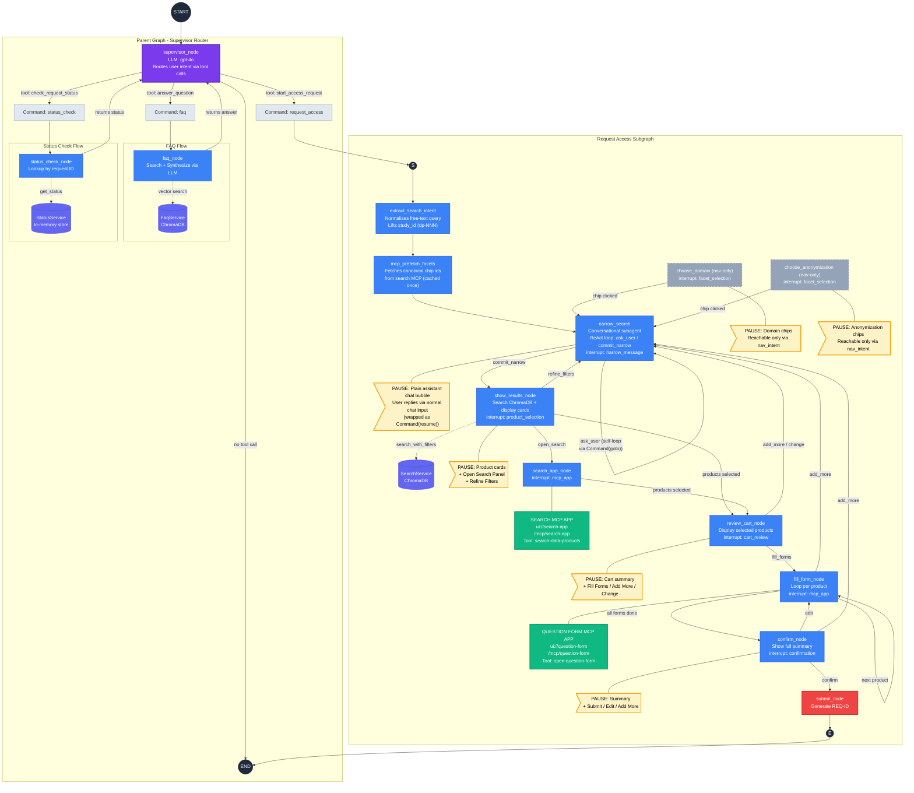
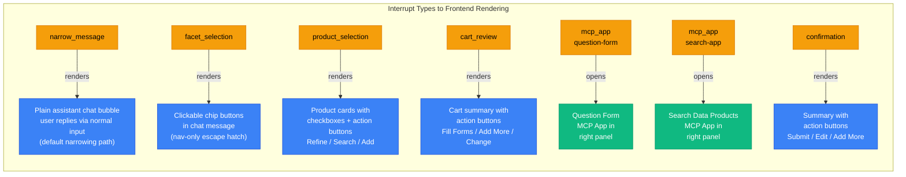
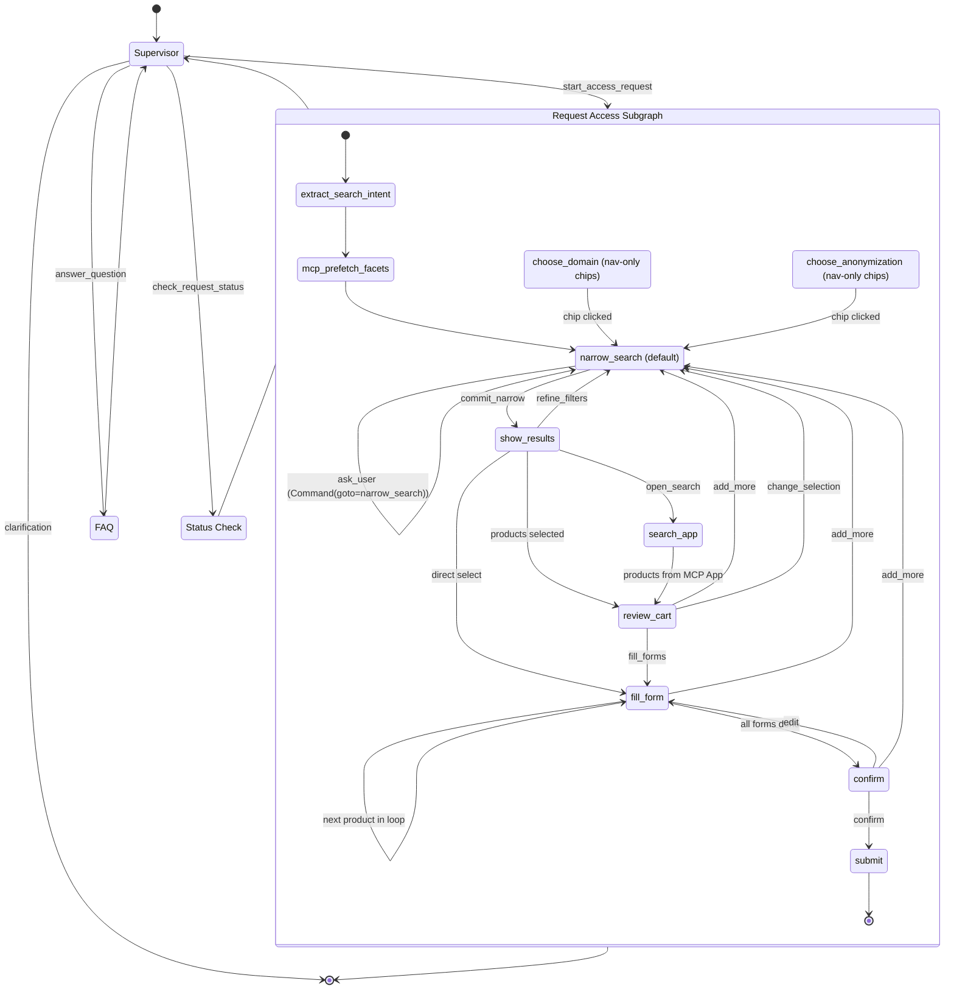
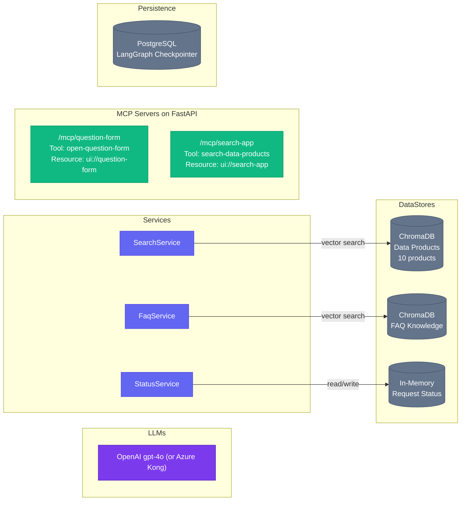

# Data Governance Chat — Graph Architecture

## Full System Diagram

## Interrupt Types at Each Node

Every `interrupt()` call pauses the graph and sends a payload to the frontend.
The frontend renders appropriate UI and resumes the graph with user input.

Every interrupt payload also carries a `prompt_id` (UUID per `interrupt()` call, plus the stable `"mcp_search"` id for the search panel). The frontend stores the active id in `ChatService.currentInterrupt` and passes it down to every `<app-message>` so historical bubbles whose `prompt_id` no longer matches render as **superseded** — their widget is hidden and the bubble's content is replaced with a single `User Skipped <Action>` notice. This keeps the user from clicking on stale chips/buttons after the conversation has moved on.

## Intent Switching — How Users Can Change Direction

The system supports mid-flow navigation at every step. Users can escape to earlier stages or switch intent entirely.

`choose_domain` and `choose_anonymization` are reachable **only** via `nav_intent` (the user typing something like "change the anonymization") — they are not on the default story arc. The `narrow_search` self-loop is implemented as a `Command(goto="narrow_search")` after each `interrupt()` so each node execution stays at exactly one interrupt boundary, avoiding the multi-`interrupt()`-in-one-node rerun trap.

## Services and External Dependencies

## Color Legend

| Color | Meaning |
|---|---|
| **Purple** | Supervisor / LLM nodes |
| **Blue** | Graph nodes (interrupt-driven) |
| **Yellow/Amber** | Interrupt pause points (user input required) |
| **Green** | MCP Apps (interactive UI panels) |
| **Indigo** | Backend services |
| **Gray** | Data stores and persistence |
| **Red** | Terminal node (submit) |

## Node Reference

| Node | Interrupt Type | MCP App | Service | User Actions |
|---|---|---|---|---|
| `supervisor_node` | — | — | OpenAI LLM (gpt-4o) | Free text, tool routing |
| `extract_search_intent` | — | — | OpenAI LLM | Auto: normalises free-text query, lifts `dp-NNN` study id |
| `mcp_prefetch_facets` | — | Search MCP App (tool call) | — | Auto: caches canonical chip ids/labels once per subgraph entry |
| `narrow_search` (default) | `narrow_message` | — | OpenAI LLM (gpt-4o, tool-calling) | Reply in chat — agent asks for missing facets and commits |
| `choose_domain` (nav-only) | `facet_selection` | — | — | Click domain chip — reachable only via `nav_intent` |
| `choose_anonymization` (nav-only) | `facet_selection` | — | — | Click anonymization chip — reachable only via `nav_intent` |
| `show_results_node` | `product_selection` | — | SearchService (ChromaDB) | Select products, Open Search Panel, Refine Filters |
| `search_app_node` | `mcp_app` | Search MCP App | — | Full search UI in panel, multi-select, confirm |
| `review_cart_node` | `cart_review` | — | — | Fill Forms, Add More, Change Selection |
| `fill_form_node` | `mcp_app` (loops) | Question Form MCP App | — | Fill form, submit, + Add More Products |
| `confirm_node` | `confirmation` | — | — | Submit, Edit Forms, + Add More Products |
| `submit_node` | — | — | — | Terminal: generates REQ-ID |
| `faq_node` | — | — | FaqService (ChromaDB) + LLM | Auto: returns answer |
| `status_check_node` | — | — | StatusService (in-memory) | Auto: returns status |

## Key Design Patterns

### 1. Conversational Funnel + MCP App Escalation
The flow starts with a textual narrowing conversation (the `narrow_search` subagent — plain chat, no chips by default), progresses to richer in-chat UI (product cards), and escalates to full MCP App panels (search app, form app) only when the interaction requires it. Chip-based facet pickers (`choose_domain`, `choose_anonymization`) survive only as `nav_intent` escape hatches for users who explicitly ask to "change the anonymization" mid-flow.

### 2. Universal "Back to narrow_search" Escape Hatch
Every node downstream of `narrow_search` can route back to it through `handle_navigation` → `invalidate_downstream_state` → `goto_target_step`, which clears stale state. This enables:
- **Refine Filters** from `show_results`
- **Add More Products** from `review_cart`, `fill_form`, and `confirm`
- **Change Selection** from `review_cart`

When the rewind target is `narrow_search`, the invalidation step intentionally **preserves** `selected_domains` and `selected_anonymization` so the agent keeps prior context for refinements; the user's typed hint is threaded through via the `narrow_refine_hint` state field.

### 3. Supervisor as Intent Classifier
The supervisor uses LLM tool-calling (gpt-4o) to classify user intent into one of three flows. If intent is unclear, it asks for clarification instead of guessing. After FAQ or Status Check, control returns to the supervisor for the next turn.

### 4. Interrupt-Driven Human-in-the-Loop
Every user-facing step uses LangGraph's `interrupt()` to pause execution, serialize state to PostgreSQL, and wait for the frontend to resume with user input. The graph never blocks — it checkpoints and exits, resuming exactly where it left off when the user responds. Each interrupt payload carries a `prompt_id` (UUID per call, plus the stable `"mcp_search"` id for the search panel); the frontend uses id equality to gate the actionability of historical bubbles, replacing superseded ones with a `User Skipped <Action>` notice.

### 5. Single-Interrupt-Per-Node Discipline
Nodes that need multiple round-trips with the user (notably `narrow_search`) implement one `interrupt()` per node execution and route back to themselves with `Command(goto=...)` after processing the resume. This avoids the multi-`interrupt()`-in-one-node rerun trap, where non-deterministic LLM calls during replay would invalidate cached interrupt correlation.
