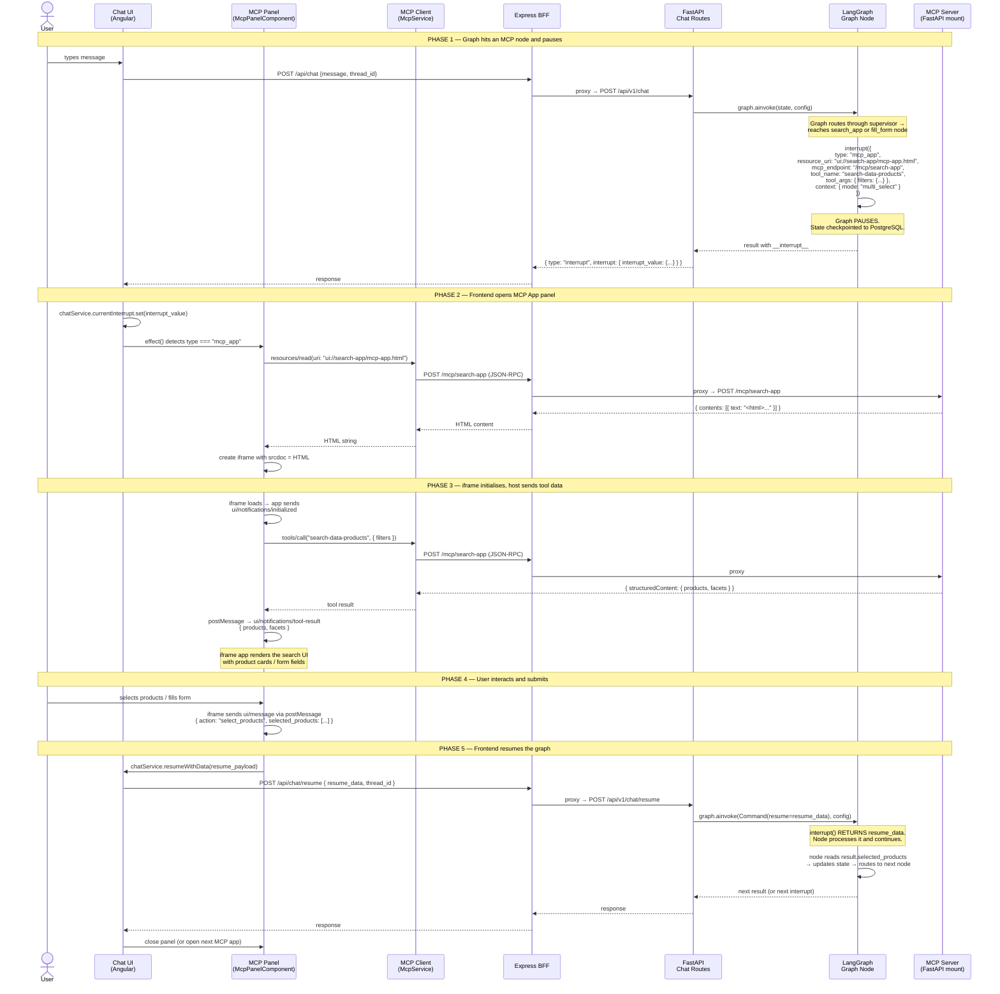

# MCP Apps — Interrupt, Render & Resume Flow

How LangGraph orchestrates MCP App interactions end-to-end: from graph node to UI panel and back.

## High-Level Architecture

```
┌─────────────────────────────────────────────────────────────────────────┐
│  BROWSER                                                                │
│                                                                         │
│  ┌──────────────┐    ┌──────────────────────────────────────────────┐   │
│  │              │    │  MCP Panel (McpPanelComponent)               │   │
│  │  Chat UI     │    │                                              │   │
│  │              │    │  ┌─────────────────────────┐                 │   │
│  │  messages[]  │    │  │ iframe (srcdoc)         │                 │   │
│  │  input box   │    │  │                         │  postMessage    │   │
│  │              │◄───┤  │  MCP App HTML           │◄───────────────►│   │
│  │              │    │  │  (search / form UI)     │                 │   │
│  │              │    │  │                         │                 │   │
│  └──────┬───────┘    │  └─────────────────────────┘                 │   │
│         │            │         ▲                                    │   │
│         │            │         │ JSON-RPC over postMessage          │   │
│         │            │         │ (ui/initialize, ui/message,        │   │
│         │            │         │  ui/notifications/tool-result)     │   │
│         │            │         ▼                                    │   │
│         │            │  ┌─────────────────────────┐                 │   │
│         │            │  │ MCP Client (McpService)  │                │   │
│         │            │  │ JSON-RPC over HTTP       │                │   │
│         │            │  └──────────┬──────────────┘                 │   │
│         │            └─────────────┼────────────────────────────────┘   │
│         │                          │                                    │
└─────────┼──────────────────────────┼────────────────────────────────────┘
          │ REST                     │ Streamable HTTP
          │ /api/v1/chat             │ /mcp/{app-name}
          │ /api/v1/chat/resume      │
          ▼                          ▼
┌─────────────────────────────────────────────────────────────────────────┐
│  EXPRESS BFF  (proxy layer — localhost:4200)                             │
│                                                                         │
│    /api/*   ──►  http://localhost:8000/api/v1/*                         │
│    /mcp/*   ──►  http://localhost:8000/mcp/*                            │
└─────────────────────────────────────────────────────────────────────────┘
          │                          │
          ▼                          ▼
┌─────────────────────────────────────────────────────────────────────────┐
│  FASTAPI BACKEND  (localhost:8000)                                      │
│                                                                         │
│  ┌────────────────────┐     ┌──────────────────────────────────┐       │
│  │ Chat Routes        │     │ MCP Servers (via registry.py)    │       │
│  │ POST /chat         │     │                                  │       │
│  │ POST /chat/resume  │     │  /mcp/search-app                 │       │
│  │        │           │     │    └─ search-data-products tool  │       │
│  │        ▼           │     │    └─ ui://search-app resource   │       │
│  │ ┌──────────────┐   │     │                                  │       │
│  │ │ ChatService   │   │     │  /mcp/question-form              │       │
│  │ │  .send()      │   │     │    └─ open-question-form tool   │       │
│  │ │  .resume()    │   │     │    └─ ui://question-form resource│       │
│  │ └──────┬───────┘   │     └──────────────────────────────────┘       │
│  └────────┼───────────┘                                                 │
│           ▼                                                             │
│  ┌──────────────────────────────────────────────────┐                   │
│  │ LangGraph (compiled graph + PostgreSQL checkpoint)│                   │
│  │                                                    │                   │
│  │  supervisor ──► request_access subgraph            │                   │
│  │                   ├─ extract_search_intent          │                   │
│  │                   ├─ mcp_prefetch_facets            │                   │
│  │                   ├─ narrow_search (text agent) ──► interrupt() │      │
│  │                   │       (narrow_message — default)│                   │
│  │                   ├─ choose_domain / _anonymization │ ◄ chip nav-only  │
│  │                   ├─ show_results (cards)          │                   │
│  │                   ├─ search_app ──► interrupt()    │ ◄── MCP App node │
│  │                   ├─ review_cart                   │                   │
│  │                   ├─ fill_form  ──► interrupt()    │ ◄── MCP App node │
│  │                   ├─ confirm                       │                   │
│  │                   └─ submit                        │                   │
│  └──────────────────────────────────────────────────┘                   │
└─────────────────────────────────────────────────────────────────────────┘
```

## Sequence Diagram — MCP App Interrupt & Resume



## Interrupt Payload Structure

When a graph node triggers an MCP App, it calls `interrupt()` with this structure:

```python
interrupt({
    "type": "mcp_app",                              # tells the UI to open the MCP panel
    "resource_uri": "ui://search-app/mcp-app.html",  # MCP resource URI for the app HTML
    "mcp_endpoint": "/mcp/search-app",               # HTTP endpoint for JSON-RPC calls
    "tool_name": "search-data-products",             # MCP tool to invoke on init
    "tool_args": { "filters": { ... } },             # arguments for that tool
    "context": { "mode": "multi_select" },           # extra context for the app
})
```

| Field | Purpose |
|-------|---------|
| `type` | Always `"mcp_app"` — the frontend uses this to distinguish from other interrupt types (`narrow_message`, `facet_selection`, `product_selection`, `cart_review`, `confirmation`) |
| `resource_uri` | The MCP resource URI. The frontend calls `resources/read` with this to fetch the app HTML |
| `mcp_endpoint` | The HTTP path where the MCP server is mounted (e.g. `/mcp/search-app`). The frontend's `McpService` sends JSON-RPC requests here |
| `tool_name` | Which MCP tool to call once the app is loaded. The result is sent into the iframe as `ui/notifications/tool-result` |
| `tool_args` | Arguments for the tool call (filters, section, etc.) |
| `context` | Additional context passed into the iframe (selected products, draft form values, product index, etc.) |

## Where the MCP Client Lives

The MCP client is implemented in the **Angular frontend**, not the backend:

```
frontend/client/src/app/
├── core/services/
│   ├── mcp.service.ts          ◄── MCP CLIENT (JSON-RPC over HTTP)
│   └── chat.service.ts         ◄── manages interrupt state + resume
└── features/mcp-panel/
    └── mcp-panel.component.ts  ◄── HOST: iframe + postMessage bridge
```

### McpService (the MCP client)

- Sends **JSON-RPC** requests to the MCP server endpoints via standard HTTP POST
- Two methods: `readResource(uri)` and `callTool(name, args)`
- Endpoint is set dynamically from the interrupt's `mcp_endpoint` field
- Requests go through the BFF proxy: browser → `localhost:4200/mcp/*` → `localhost:8000/mcp/*`

### McpPanelComponent (the host bridge)

- Watches `chatService.currentInterrupt()` via an Angular `effect()`
- When `type === "mcp_app"`: fetches HTML via `mcpService.readResource()`, renders in iframe
- Listens for `postMessage` events from the iframe (JSON-RPC protocol)
- Handles these iframe messages:
  - `ui/initialize` → responds with init config
  - `ui/notifications/initialized` → triggers tool call, sends result to iframe
  - `tools/call` → proxies to `mcpService.callTool()`, returns result
  - `ui/message` → parses the app's output, calls `chatService.resumeWithData()`
- Also handles the "cancel" action: resumes the graph with `{ cancelled: true }`

### ChatService (interrupt + resume)

- `currentInterrupt` — Angular signal holding the active interrupt value
- `resumeWithData(data)` — POSTs to `/api/chat/resume` with `{ resume_data, thread_id }`

## Two Parallel Communication Channels

The system uses two independent HTTP paths that serve different purposes:

```
                     Browser
                    /       \
                   /         \
          REST API             MCP Streamable HTTP
     /api/v1/chat/*            /mcp/{app-name}
          |                         |
     Graph control             UI content & data
     (invoke, resume)          (HTML, tool results)
          |                         |
          ▼                         ▼
     ChatService ──►           MCP Server ──►
     LangGraph graph           resources/read → HTML
                               tools/call → structured data
```

| Channel | Protocol | Purpose | When used |
|---------|----------|---------|-----------|
| REST API (`/api/v1/chat/*`) | HTTP POST/JSON | Start graph, resume after interrupt | Before and after MCP App interaction |
| MCP (`/mcp/{app-name}`) | JSON-RPC over HTTP | Fetch app HTML, call MCP tools | During MCP App interaction (panel open) |

The graph **never** calls the MCP server directly. The MCP servers are only accessed by the frontend's `McpService`. The graph nodes define *which* MCP app to open and *what* tool to call via the interrupt payload — the frontend does the actual MCP communication.

## Pause & Resume Lifecycle

```
 Node calls interrupt()
         │
         ▼
 ┌───────────────────────┐
 │  PAUSED               │
 │  State checkpointed   │   Graph is frozen. The Python process
 │  to PostgreSQL         │   can restart — state survives.
 │  (thread_id scoped)   │
 └───────────┬───────────┘
             │
             │  Frontend receives interrupt payload
             │  Opens MCP panel, loads app, user interacts
             │
             ▼
 ┌───────────────────────┐
 │  RESUME               │
 │  POST /chat/resume    │   resume_data = { selected_products: [...] }
 │  → Command(resume=    │   or { form_data: "...", submitted: true }
 │     resume_data)      │   or { action: "user_message", text: "..." }
 │                       │   or { cancelled: true }
 └───────────┬───────────┘
             │
             ▼
 ┌───────────────────────┐
 │  interrupt() RETURNS  │   The interrupt() call in the node
 │  resume_data is the   │   returns whatever the frontend sent.
 │  return value         │   The node processes it and the graph
 │                       │   continues to the next step.
 └───────────────────────┘
```

### Resume payloads by app

| MCP App | Resume payload | What the node does |
|---------|---------------|-------------------|
| Search App | `{ selected_products: [...] }` | Stores in `state.selected_products`, routes to `review_cart` |
| Search App | `{ cancelled: true }` | Treats as empty selection |
| Question Form | `{ form_data: "...", submitted: true }` | Stores in `state.form_drafts[product_id]`, advances to next product or `confirm` |
| Question Form | `{ action: "add_more" }` | Routes back to `narrow_search` to add more products |
| Question Form | `{ action: "back_to_selection" }` | Routes back to `narrow_search` |
| Any MCP App | `{ action: "user_message", text: "..." }` | User typed in chat while panel was open — node processes the text (fill_form uses LLM intent classification) |

## Stale-Interrupt UX (`prompt_id` correlation)

Every interrupt payload carries a `prompt_id`: a fresh UUID for each `interrupt()` call (see `_hitl_step` and `narrow_search.py`), or the stable `"mcp_search"` id for the search-app panel. The frontend uses id equality to decide whether a historical bubble's widget is still actionable.

`ChatService` keeps the active payload in a `currentInterrupt` signal (cleared on every resume submit, replaced on every new `interrupt` event). `ChatComponent` derives `activePromptId` from it and passes it into every `<app-message>`. When a message's own `prompt_id` no longer matches, the bubble's prompt text and any widget (chips, product cards, cart actions, confirmation buttons, MCP App trigger) are hidden and replaced with a single `User Skipped <Action>` notice in dashed-badge styling. `narrow_message` bubbles are exempt — they're plain text and have nothing to skip past.

In practice this means: if the user is on the search-app MCP panel and types "I need to change the anonymization" instead of submitting from the panel, the conversation moves into `narrow_search`, the panel closes, and the historical bubble that once carried the `mcp_app` interrupt now reads `User Skipped App Action` — preventing a stale click on the now-irrelevant trigger.
