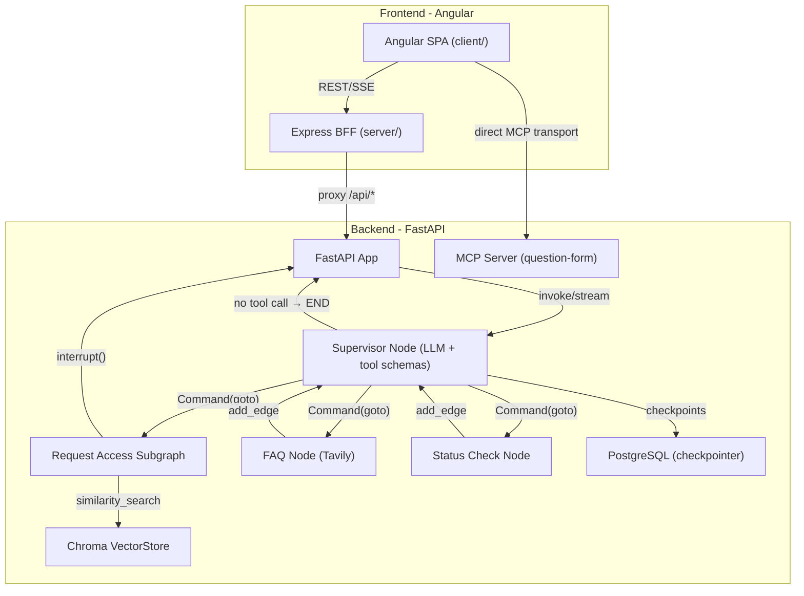
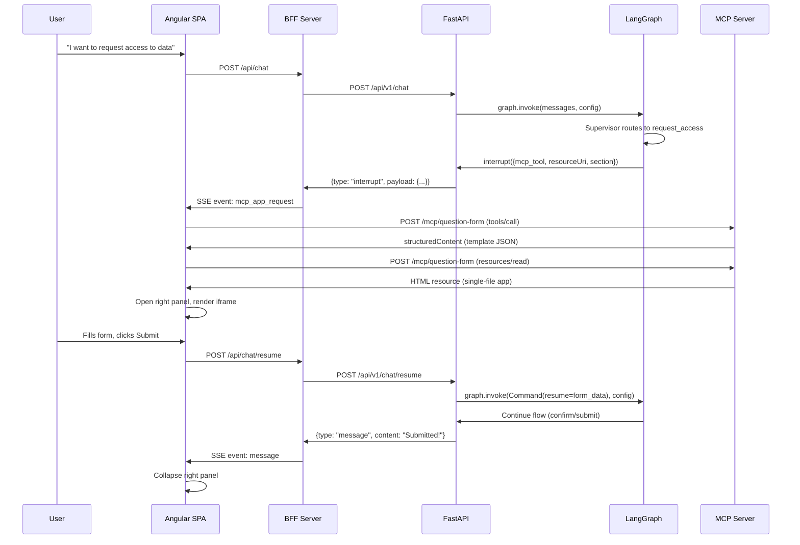

# Data Governance Chat Application -- Plan V1

## Architecture Overview



## Data Flow for MCP App Interaction



## Project Structure

```
data-governance-app/
├── backend/
│   ├── app/
│   │   ├── main.py                      # FastAPI entry, mounts MCP + API routers
│   │   ├── api/
│   │   │   ├── deps.py                  # Dependency injection (graph, services, db session)
│   │   │   └── routes/
│   │   │       ├── chat.py              # POST /chat, POST /chat/resume, GET /chat/stream
│   │   │       └── health.py            # GET /health
│   │   ├── core/
│   │   │   ├── config.py               # Pydantic Settings (env vars, model name)
│   │   │   └── logging.py
│   │   ├── db/
│   │   │   ├── base.py                  # SQLAlchemy DeclarativeBase
│   │   │   ├── session.py              # AsyncEngine, async_sessionmaker
│   │   │   └── init_db.py             # Create tables / verify connection
│   │   ├── models/
│   │   │   ├── user.py                  # User model (id, email, name, department)
│   │   │   ├── thread.py              # Thread model (id, user_id, title, created_at)
│   │   │   └── access_request.py      # AccessRequest model (id, thread_id, status, product, etc.)
│   │   ├── schema/
│   │   │   ├── chat.py                  # ChatRequest, ChatResponse, InterruptPayload
│   │   │   └── mcp.py                   # MCP-related response types
│   │   ├── service/
│   │   │   ├── chat_service.py          # Wraps graph.invoke / Command(resume)
│   │   │   ├── search_service.py        # Chroma vector store for data product search
│   │   │   ├── faq_service.py           # Tavily web search wrapper
│   │   │   └── status_service.py        # Request status lookup (queries DB)
│   │   ├── graph/
│   │   │   ├── state.py                 # SupervisorState, AccessRequestState
│   │   │   ├── supervisor.py            # Intent classification + Command routing
│   │   │   ├── builder.py              # Compiles parent graph with subgraphs
│   │   │   ├── nodes/                   # Simple (non-subgraph) nodes
│   │   │   │   ├── faq.py              # Calls faq_service + LLM synthesis
│   │   │   │   └── status_check.py     # Calls status_service
│   │   │   └── subgraphs/
│   │   │       └── request_access/      # Self-contained subgraph
│   │   │           ├── graph.py         # Subgraph StateGraph + compile
│   │   │           └── nodes/
│   │   │               ├── search.py    # Vector search via search_service
│   │   │               ├── fill_form.py # interrupt() with MCP App payload
│   │   │               ├── confirm.py   # interrupt() for user confirmation
│   │   │               └── submit.py    # Persist to DB via status_service
│   │   └── mcp/
│   │       ├── registry.py             # Discovers + mounts MCP servers on FastAPI
│   │       └── question-form-app-python/  # Existing MCP app (moved here)
│   │           ├── server.py
│   │           ├── dist/mcp-app.html
│   │           ├── src/
│   │           ├── package.json
│   │           └── vite.config.ts
│   ├── alembic/                         # Alembic migration config
│   │   ├── alembic.ini
│   │   ├── env.py                       # Reads DATABASE_URL from settings
│   │   └── versions/                    # Migration scripts
│   ├── pyproject.toml                   # uv-managed dependencies
│   ├── uv.lock
│   └── .env                            # OPENAI_API_KEY, DATABASE_URL, TAVILY_API_KEY
│
├── frontend/
│   ├── client/                          # Angular 19 SPA
│   │   ├── src/
│   │   │   ├── app/
│   │   │   │   ├── app.component.ts     # Root layout: chat + panel
│   │   │   │   ├── app.routes.ts
│   │   │   │   ├── core/
│   │   │   │   │   ├── services/
│   │   │   │   │   │   ├── chat.service.ts      # REST + SSE to BFF
│   │   │   │   │   │   └── mcp.service.ts       # Direct MCP transport client
│   │   │   │   │   └── models/
│   │   │   │   │       ├── chat.model.ts
│   │   │   │   │       └── mcp.model.ts
│   │   │   │   ├── features/
│   │   │   │   │   ├── chat/
│   │   │   │   │   │   ├── chat.component.ts     # Message list + input
│   │   │   │   │   │   ├── message/
│   │   │   │   │   │   │   └── message.component.ts
│   │   │   │   │   │   └── chat-input/
│   │   │   │   │   │       └── chat-input.component.ts
│   │   │   │   │   └── mcp-panel/
│   │   │   │   │       ├── mcp-panel.component.ts  # Collapsible right panel
│   │   │   │   │       └── mcp-iframe.component.ts # Sandboxed iframe renderer
│   │   │   │   └── shared/
│   │   │   │       └── components/
│   │   │   ├── environments/
│   │   │   ├── styles.scss
│   │   │   └── index.html
│   │   ├── angular.json
│   │   ├── package.json
│   │   └── tsconfig.json
│   │
│   └── server/                          # BFF (Express + TypeScript)
│       ├── src/
│       │   ├── index.ts                 # Express entry, serves Angular + proxies API
│       │   ├── routes/
│       │   │   └── api-proxy.ts         # Proxy /api/* to FastAPI
│       │   └── middleware/
│       │       └── cors.ts
│       ├── package.json
│       └── tsconfig.json
│
└── question-template.json               # Stays at root (referenced by MCP server)
```

## Key Implementation Details

### Backend: LangGraph Graph Design

**State schema** (`graph/state.py`):

```python
class SupervisorState(TypedDict):
    messages: Annotated[list, operator.add]
    active_intent: str                    # "request_access" | "faq" | "status_check"
    thread_id: str
    user_id: str

class AccessRequestState(TypedDict):
    messages: Annotated[list, operator.add]
    current_step: str                     # "search" | "fill_form" | "confirm" | "submit"
    selected_product: dict | None
    form_draft: dict | None
    form_template: dict | None
```

**Supervisor as a single custom node with tool schemas** (`graph/supervisor.py`): The supervisor is one node function. The LLM has tool schemas bound for structured decision-making, but there is NO `ToolNode` -- the supervisor node interprets the tool call and returns `Command` directly. This avoids the Q4 warning about hiding subgraphs inside tool functions, and avoids the issue of `ToolNode` swallowing `Command` returns.

- If the LLM returns **no tool call**, the user's intent is unclear or the LLM is responding directly (clarification, greeting, synthesis after FAQ/status). The node returns a plain state update with the response message -> conditional edge routes to `END`.
- If the LLM returns a **tool call**, the node interprets it and returns `Command(goto=...)` to route to the appropriate subgraph/node.
- FAQ and status results loop back to the supervisor so the LLM can synthesize a natural-language response.

**Tool schemas** (defined as Pydantic models or `@tool` for schema extraction, but NOT executed by `ToolNode`):

```python
from langchain_core.tools import tool

@tool
def start_access_request(search_query: str) -> str:
    """Start a data product access request. Call when the user wants to request access to a data product."""
    return ""

@tool
def answer_question(question: str) -> str:
    """Answer a question about data governance or the request access process."""
    return ""

@tool
def check_request_status(request_id: str = "") -> str:
    """Check the status of an existing access request."""
    return ""

SUPERVISOR_TOOLS = [start_access_request, answer_question, check_request_status]
```

**Supervisor node** (the actual routing logic):

```python
from langgraph.types import Command
from langchain_openai import ChatOpenAI

llm = ChatOpenAI(model=settings.MODEL_NAME).bind_tools(SUPERVISOR_TOOLS)

def supervisor_node(state: SupervisorState) -> Command | dict:
    response = llm.invoke(state["messages"])

    if not response.tool_calls:
        return {"messages": [response]}

    tc = response.tool_calls[0]
    if tc["name"] == "start_access_request":
        return Command(
            update={"messages": [response], "active_intent": "request_access"},
            goto="request_access"
        )
    elif tc["name"] == "answer_question":
        return Command(
            update={"messages": [response], "active_intent": "faq"},
            goto="faq"
        )
    elif tc["name"] == "check_request_status":
        return Command(
            update={"messages": [response], "active_intent": "status_check"},
            goto="status_check"
        )
    return {"messages": [response]}
```

**Graph wiring** (in `builder.py`): No static edges FROM supervisor -- only `Command` handles outward routing.

```python
parent_graph = (
    StateGraph(SupervisorState)
    .add_node("supervisor", supervisor_node)
    .add_node("request_access", access_request_subgraph)
    .add_node("faq", faq_node)
    .add_node("status_check", status_check_node)
    .add_edge(START, "supervisor")
    # No add_edge FROM supervisor -- Command handles all outward routing
    .add_edge("faq", "supervisor")           # Loop back for LLM synthesis
    .add_edge("status_check", "supervisor")  # Loop back for LLM synthesis
    .add_edge("request_access", END)         # Subgraph completes the flow
    .add_conditional_edges("supervisor", lambda s: END if not ... else ...)
    .compile(checkpointer=checkpointer)
)
```

> **Note (Q1 warning):** `Command` adds dynamic edges. Static `add_edge` from the supervisor would fire in parallel with `Command` routing. That's why supervisor has NO outgoing `add_edge`.

> **Note (Q3 warning):** Subgraph nodes that call `interrupt()` must be idempotent before the interrupt point -- all code before `interrupt()` re-runs on resume. Cache search results in state; place side effects after `interrupt()`.

> **V2: Long-term Store.** Cross-thread memory (`Store`) for user preferences (department, preferred approver) is not included in V1. Plan to add `InMemoryStore` / `PostgresStore` in a future iteration per Q6 Layer 3.

> **V2: Mid-flow intent switching.** When the graph is paused at an interrupt, classifying new user messages as "resume payload" vs. "side FAQ" vs. "intent switch" is application-level orchestration (Q5). V1 treats all messages during a pause as resume payloads. V2 adds classification logic in `chat_service.py` with pause-tracking state fields (`paused_flow`, `paused_step`, `resume_available`).

**Request access subgraph** (`graph/subgraphs/request_access/`): Self-contained subgraph with its own `graph.py` (builder) and `nodes/` folder:
- `nodes/search.py` -- calls `search_service.search()`, returns results via `interrupt()` for user to pick
- `nodes/fill_form.py` -- `interrupt()` with MCP App payload (`resourceUri`, `mcp_endpoint`)
- `nodes/confirm.py` -- `interrupt()` for user confirmation
- `nodes/submit.py` -- persists the request to DB via `status_service`, returns success
- `graph.py` -- wires the nodes into a `StateGraph(AccessRequestState)`, compiled with `checkpointer=True`

**FAQ node** (`graph/nodes/faq.py`): Calls `faq_service.search()` to get Tavily results, then synthesizes an answer with ChatOpenAI.

**Status check node** (`graph/nodes/status_check.py`): Calls `status_service.get_status()` to return request status.

### Backend: Service Layer

Services encapsulate external integrations and are injected into graph nodes via FastAPI dependency injection / runtime context.

**`service/search_service.py`** -- In-memory ChromaDB seeded at startup with ~15 sample data products (e.g. "Customer Demographics", "Clinical Trial Results", "Pharmacovigilance Reports"). Each document has metadata like `domain`, `owner`, `sensitivity_level`.

```python
from langchain_chroma import Chroma
from langchain_openai import OpenAIEmbeddings

class SearchService:
    def __init__(self, settings):
        embeddings = OpenAIEmbeddings(model="text-embedding-3-small", api_key=settings.OPENAI_API_KEY)
        self._store = Chroma(embedding_function=embeddings, collection_name="data_products")
        self._seed()

    def _seed(self):
        self._store.add_texts(
            texts=["Customer Demographics - PII dataset...", ...],
            metadatas=[{"domain": "commercial", "owner": "CDO", "sensitivity": "high"}, ...],
        )

    def search(self, query: str, k: int = 5) -> list[dict]:
        results = self._store.similarity_search_with_score(query, k=k)
        return [{"content": doc.page_content, "metadata": doc.metadata, "score": score} for doc, score in results]
```

**`service/faq_service.py`** -- Wraps Tavily web search.

```python
from langchain_community.tools.tavily_search import TavilySearchResults

class FaqService:
    def __init__(self, settings):
        self._search = TavilySearchResults(max_results=3, api_key=settings.TAVILY_API_KEY)

    def search(self, query: str) -> list[dict]:
        return self._search.invoke(query)
```

**`service/status_service.py`** -- Mock request status lookup (returns sample statuses).

**`service/chat_service.py`** -- Wraps `graph.invoke()` and `Command(resume=...)` with thread config management.

### Backend: PostgreSQL Checkpointer

The graph is compiled with `PostgresSaver` for durable state persistence. The `DATABASE_URL` from `.env` is used:

```python
from langgraph.checkpoint.postgres.aio import AsyncPostgresSaver

async def get_checkpointer():
    checkpointer = AsyncPostgresSaver.from_conn_string(settings.DATABASE_URL)
    await checkpointer.setup()  # Creates tables on first run
    return checkpointer
```

This replaces `InMemorySaver` so that conversation state, paused interrupts, and form drafts survive server restarts. Note: the LangGraph checkpointer manages its own tables; it coexists with the application's SQLAlchemy models in the same database.

### Backend: Database Layer (SQLAlchemy + Alembic)

All application DB interactions go through SQLAlchemy async ORM. Alembic handles schema migrations.

**`db/session.py`** -- async engine + session factory:

```python
from sqlalchemy.ext.asyncio import create_async_engine, async_sessionmaker

engine = create_async_engine(settings.DATABASE_URL.replace("postgresql://", "postgresql+asyncpg://"))
async_session = async_sessionmaker(engine, expire_on_commit=False)
```

**`models/`** -- initial models for future user/thread management:

- `User` -- `id`, `email`, `name`, `department`, `created_at`
- `Thread` -- `id`, `user_id` (FK), `title`, `status`, `created_at`, `updated_at`
- `AccessRequest` -- `id`, `thread_id` (FK), `product_name`, `status` (draft/pending/approved/rejected), `form_data` (JSONB), `submitted_at`

**`alembic/`** -- initialized with `alembic init alembic`, `env.py` configured to read `DATABASE_URL` from settings and auto-detect models via `Base.metadata`. Initial migration creates the three tables.

### Backend: MCP Integration

The MCP server (`mcp/question-form-app-python/server.py`) keeps its current `StreamableHTTPSessionManager` setup. `mcp/registry.py` discovers MCP server folders and mounts each at `/mcp/{name}` on the FastAPI app using the ASGI sub-application pattern.

### Backend: FastAPI Chat Endpoint

- `POST /api/v1/chat` -- accepts `{message, thread_id}`, invokes graph, returns response or interrupt payload
- `POST /api/v1/chat/resume` -- accepts `{resume_data, thread_id}`, invokes graph with `Command(resume=...)`
- `GET /api/v1/chat/stream/{thread_id}` -- SSE endpoint for streaming graph output

### Frontend: Angular Chat + MCP Panel

- **Chat component**: message list with user/assistant bubbles, input bar at bottom.
- **MCP Panel**: slides in from the right when an interrupt with `resourceUri` arrives. Contains a sandboxed iframe that loads the MCP App HTML. Collapses when the MCP App emits a submit event.
- **Chat Service**: connects to BFF via REST + SSE for streaming.
- **MCP Service**: uses the MCP streamable HTTP client to call tools and fetch resources directly from the MCP endpoint.

### Frontend: BFF Server

Express server that:
1. Serves the built Angular SPA static files
2. Proxies `/api/*` requests to `http://localhost:8000/api/v1/*` (FastAPI)
3. Proxies SSE connections for chat streaming

## Dependencies

**Backend** (`pyproject.toml`, managed by `uv`):
- `fastapi`, `uvicorn[standard]` -- web server
- `langgraph`, `langchain-openai`, `langchain-core` -- LLM orchestration
- `langgraph-checkpoint-postgres` -- PostgreSQL checkpointer
- `langchain-chroma` -- in-memory vector store for data product search
- `langchain-community` -- Tavily search tool for FAQ
- `sqlalchemy[asyncio]` -- ORM
- `asyncpg` -- async PostgreSQL driver for SQLAlchemy
- `alembic` -- database migrations
- `mcp` -- MCP SDK
- `pydantic-settings` -- configuration
- `sse-starlette` -- SSE support
- `httpx` -- async HTTP
- `psycopg[binary]` -- PostgreSQL driver (for LangGraph checkpointer)

Backend is initialized with `uv init` and dependencies added via `uv add`. Run with `uv run uvicorn app.main:app`.

**Frontend client** (`package.json`):
- `@angular/core` v19 -- framework
- `@modelcontextprotocol/sdk` -- MCP client for direct resource fetch

**Frontend server** (`package.json`):
- `express` -- HTTP server
- `http-proxy-middleware` -- API proxy to FastAPI
